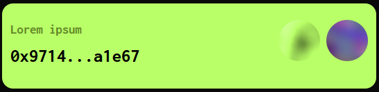

# deign snippets for reference

## green box



```html
<div class="container rounded-4 my-2 galactic-green-box">
	<div class="py-4">
		<div class="row">
			<div class="col-7">
				<p style="margin-bottom: -20px; color: #648A29;">Lorem ipsum</p>
				</br>
				<h3 style="font-size: 20pt;">0x9714...a1e67</h3>
			</div>
			<div class="col" style="text-align: right;">
				
				
			</div>
		</div>
	</div>
</div>
```


## green features


```html

```


## green highlight


```html

```


## pink highlight


```html

```


## purple box table


```html

```


## purple single line


```html

```


## purple table


```html

```


## white box content


```html

```


## white box examine


```html

```
